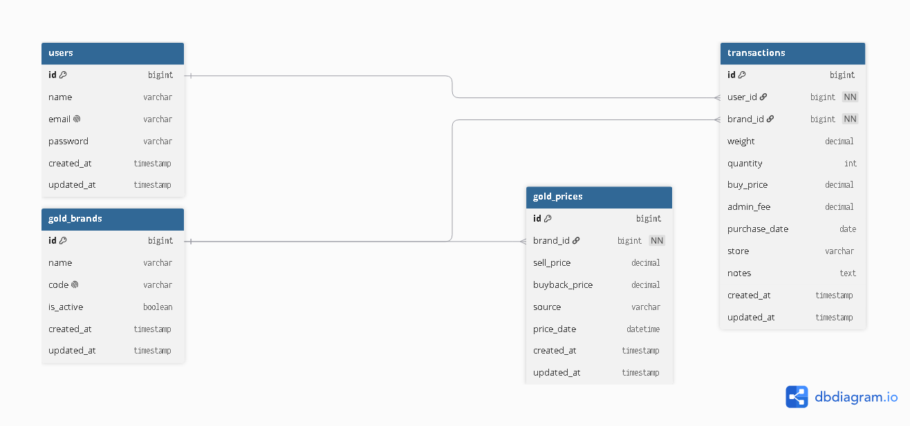

# 🥇 Goldfolio


Goldfolio adalah aplikasi web berbasis **Laravel 13** yang dirancang untuk membantu pengguna mencatat, memantau, dan menganalisis investasi emas fisik seperti **Antam, UBS, dan Galeri24**.

Aplikasi ini memungkinkan pengguna mencatat transaksi pembelian emas, memantau nilai portofolio, menghitung average cost, serta mengetahui profit/loss berdasarkan harga emas terbaru.

---

## 🚀 Project Status

**Version** : `v0.1.0`

**Current Sprint** : `Sprint 2.5`

**Status** : 🚧 Under Development

---

## ✨ Features

### Current Features

- Database Design
- Database Migration
- Database Seeder
- Entity Relationship Diagram (ERD)
- Project Documentation

### Planned Features

- 🔐 Authentication
- 🪙 Gold Brand Management
- 📝 Gold Transaction
- 💰 Portfolio Calculation
- 📈 Profit & Loss
- 📊 Portfolio Dashboard
- 📅 Gold Price History
- 📈 Portfolio Analytics
- 📤 Export Report
- 🔔 Price Alert

---

## 🗂️ Database Design

### Entity Relationship Diagram (ERD)



---

## 🛠️ Tech Stack

- Laravel 13
- PHP 8.3
- MySQL 8.4
- Tailwind CSS
- Vite
- Git
- GitHub

---

## 📁 Project Structure

```text
goldfolio
│
├── app/
├── bootstrap/
├── config/
├── database/
├── docs/
│   ├── erd/
│   ├── screenshots/
│   └── sprint/
├── public/
├── resources/
├── routes/
├── storage/
├── tests/
│
├── README.md
├── CHANGELOG.md
├── ROADMAP.md
├── composer.json
├── package.json
└── artisan
```

---

## 🚀 Installation

Clone repository

```bash
git clone https://github.com/naufdlh16/goldfolio.git
```

Masuk ke folder project

```bash
cd goldfolio
```

Install dependency

```bash
composer install
```

Install frontend dependency

```bash
npm install
```

Copy file environment

```bash
cp .env.example .env
```

Generate application key

```bash
php artisan key:generate
```

Jalankan migration dan seeder

```bash
php artisan migrate --seed
```

Jalankan Vite

```bash
npm run dev
```

Jalankan aplikasi

```bash
php artisan serve
```

---

## 🗓️ Development Progress

### ✅ Sprint 1 – Environment Setup

- [x] Setup Development Environment
- [x] Install Laravel 13
- [x] Configure Database
- [x] Git & GitHub Setup

---

### ✅ Sprint 2 – Database

- [x] Database Design
- [x] Database Migration
- [x] Database Seeder
- [x] Entity Relationship Diagram (ERD)

---

### ✅ Sprint 2.5 – Project Foundation

- [x] README Documentation
- [x] CHANGELOG
- [x] ROADMAP
- [x] GitHub Repository
- [x] Documentation Structure
- [x] ERD Documentation

---

### 🚧 Sprint 3 – Authentication & Layout

- [ ] Authentication
- [ ] Application Layout
- [ ] Dashboard
- [ ] Gold Brand Management

---

### ⏳ Sprint 4 – Gold Transaction

- [ ] Gold Transaction CRUD
- [ ] Transaction Validation
- [ ] Transaction History

---

### ⏳ Sprint 5 – Portfolio Engine

- [ ] Portfolio Calculation
- [ ] Average Cost
- [ ] Profit & Loss

---

### ⏳ Sprint 6 – Gold Price Service

- [ ] Gold Price API Integration
- [ ] Scheduler
- [ ] Automatic Price Update

---

### ⏳ Sprint 7 – Dashboard

- [ ] Dashboard Analytics
- [ ] Portfolio Chart
- [ ] Summary Card

---

### ⏳ Sprint 8 – Reporting

- [ ] Export PDF
- [ ] Export Excel
- [ ] Transaction Report

---

### ⏳ Sprint 9 – Testing & Optimization

- [ ] Feature Testing
- [ ] Performance Optimization
- [ ] Bug Fixing

---

### ⏳ Sprint 10 – Deployment

- [ ] VPS Deployment
- [ ] Production Environment
- [ ] Final Release

---

## 📚 Documentation

Project documentation tersedia pada folder:

```text
docs/
├── erd/
├── screenshots/
└── sprint/
```

---

## 👨‍💻 Author

**Naufal Fadilah**

GitHub : https://github.com/naufdlh16

LinkedIn : https://www.linkedin.com/in/naufdlh/

---

## ⭐ Project Goals

Goldfolio dikembangkan sebagai **personal portfolio project** sekaligus **bahan penelitian skripsi**, dengan tujuan membantu pengguna mengelola investasi emas fisik secara lebih terstruktur melalui pencatatan transaksi, pemantauan portofolio, dan analisis keuntungan berdasarkan harga emas terkini.